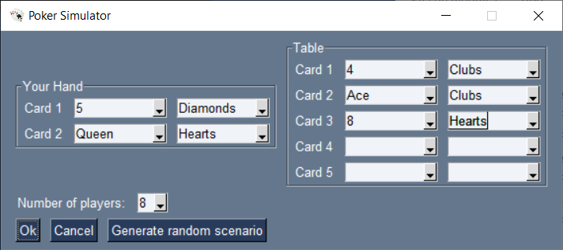
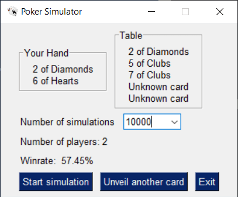
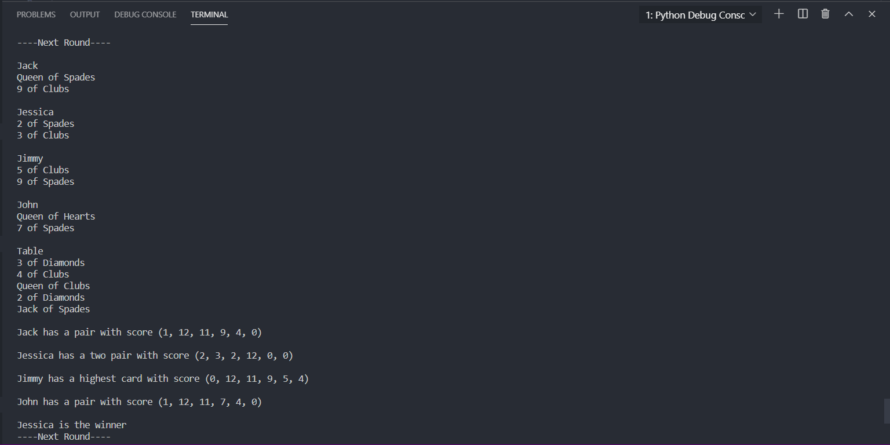

# Poker simulator
A small python project with a simple GUI to calculate the winning odds in Hold'em games. In this poker style each player
is given 2 cards and 5 are put onto the table. Players try to build the best 5 card hand possible with their cards 
plus the table ones.

## Requirements
PySimpleGUI < 4.0

tqdm <= 4.46

## Library description
There are 4 python files in this library:

- **poker.py**: this is the main library and is imported by the other scripts.
- **test.py**: a script that simulates 4 player poker games. This was built to check for
errors in the ranking system.
- **montecarlo.py**: this script simulates a given number o poker games to
calculate the probability of having a given hand. Results are saved
in a text file called montecarlo-results.txt.
- **game_simulator**: creates a GUI where users can calculate the odds of winning with
the table display they desire.

In the game's simulator first window users can choose the cards
on their hand and the cards that are on the table or generate a random scenario:

In the second window, users can choose the number of simulations they want to run.
The higher the number, the more accurate the winrate. 1000 or 10000 simulations usually
generate good results and run in seconds.

## Library design
The poker.py library is built around three classes: Card, Deck, Hand.

- The *Card* class represents a french deck card, i.e. a poker card.
- The *Deck* is a group of Cards, with some methods like shuffle.
- The *Hand* class is an extension of a Deck limited to two cards,
and with some methods representing players actions.

### Hand ranking system
To determine the best hand, the system used consists on giving each hand a score, which is 
a tuple with six elements (*e1*, *e2*, *e3*, *e4*, *e5*, *e6*).
*e1* is an int which represents the play of that hand; for example if it is a pair it is given
a 1, and if it is a two pair, it is given a 2.

*e2* is the best card of the hand, and the rest of the elements represent the rank of the next best card.
In this way, to compare two hands, we only need to compare the score tuples, and it's also
easy to compare for a human the score of two hands.

In this screenshot of test.py it's it's shown how the system works:

-